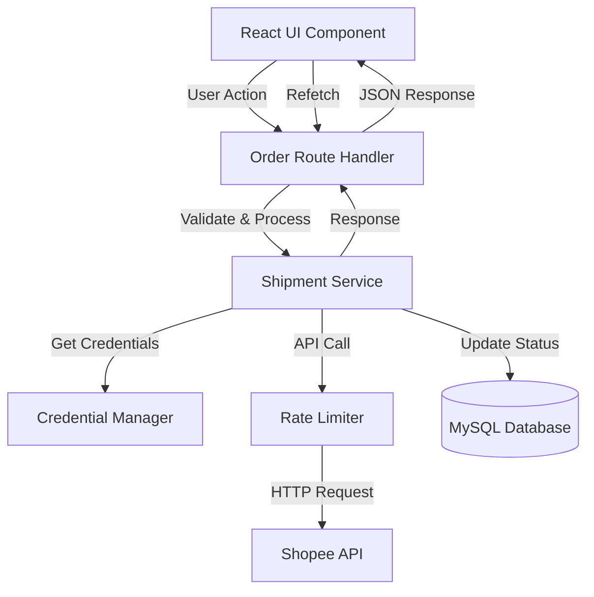

# Design Document: Order Shipment Processing

## Overview

This document provides the technical design for implementing order shipment processing functionality in the WMS application. The feature enables warehouse operators to arrange shipments for orders in "READY_TO_SHIP" status through the Shopee Open Platform API, transitioning them to "PROCESSED" status.

### Key Capabilities

- **Single Order Processing**: Process individual orders with immediate feedback
- **Batch Processing**: Handle multiple orders simultaneously with progress tracking
- **Intelligent Rate Limiting**: Automatic retry logic with exponential backoff for API throttling
- **Multi-Shop Support**: Correctly route API calls using shop-specific credentials
- **Robust Error Handling**: Comprehensive error recovery for network, authentication, and validation failures
- **Real-time UI Updates**: Immediate visual feedback and automatic list refresh

### Integration Points

The feature integrates with:
- **Shopee Open Platform API**: `/api/v2/logistics/ship_order` endpoint
- **Existing Authentication System**: Leverages `shopee-auth.ts` for token management
- **Database Layer**: Updates `shopee_orders` table via Drizzle ORM
- **Frontend Order List**: Extends `PesananSaya.tsx` component

## Architecture

### High-Level Architecture



### Component Layers

**Presentation Layer** (Frontend)
- `PesananSaya.tsx`: Order list UI with action buttons
- Toast notifications for user feedback
- Progress indicators for batch operations

**API Layer** (Backend Routes)
- `order.route.ts`: REST endpoints for shipment operations
- Request validation using Elysia schema validation
- Response formatting and error handling

**Service Layer** (Business Logic)
- `shipment.service.ts`: Core shipment processing logic (new)
- `shopee-auth.ts`: Token management and refresh (existing)
- `shopee-raw.ts`: Low-level API communication (existing)

**Data Layer**
- Drizzle ORM for database operations
- `shopee_orders` table for order state
- `shopee_credentials` table for authentication

### Request Flow

**Single Order Processing**:
1. User clicks "Atur Pengiriman" button
2. Frontend sends POST request to `/api/orders/ship/:orderSn`
3. Backend validates order eligibility (status = READY_TO_SHIP)
4. Service retrieves shop credentials via `getValidToken()`
5. Service calls Shopee API with rate limiting
6. On success, updates database order status to PROCESSED
7. Returns success response to frontend
8. Frontend displays toast and refreshes order list

**Batch Processing**:
1. User selects multiple orders and clicks batch action
2. Frontend sends POST request to `/api/orders/ship/batch` with order_sn array
3. Backend processes orders sequentially with 300ms delay
4. Each order follows single processing flow
5. Collects success/failure results
6. Returns summary with counts
7. Frontend displays progress during processing and summary at end

## Components and Interfaces

### Backend Components

#### 1. Shipment Service (`apps/api/src/services/shipment.service.ts`)

**Purpose**: Core business logic for shipment processing

**Key Functions**:

```typescript
interface ShipmentResult {
  success: boolean;
  orderSn: string;
  message?: string;
  error?: string;
}

/**
 * Process shipment for a single order
 * @param orderSn - Shopee order serial number
 * @returns Result with success status and message
 */
async function shipSingleOrder(orderSn: string): Promise<ShipmentResult>

/**
 * Process shipment for multiple orders with rate limiting
 * @param orderSns - Array of order serial numbers
 * @returns Array of results for each order
 */
async function shipBatchOrders(orderSns: string[]): Promise<ShipmentResult[]>

/**
 * Validate order eligibility for shipment
 * @param orderSn - Order serial number
 * @returns Validation result with order data or error
 */
async function validateOrderEligibility(orderSn: string): Promise<{
  valid: boolean;
  order?: OrderRecord;
  error?: string;
}>
```

**Dependencies**:
- `shopee-auth.ts`: For credential retrieval
- `shopee-raw.ts`: For API communication
- `db/client.ts`: For database operations
- `db/schema.ts`: For table definitions

#### 2. Shopee API Client Extension (`apps/api/src/services/shopee-raw.ts`)

**New Function**:

```typescript
/**
 * Call Shopee ship_order API endpoint
 * @param shopId - Shop identifier
 * @param orderSn - Order serial number
 * @returns API response with success/error
 */
export async function shipShopeeOrder(
  shopId: number,
  orderSn: string
): Promise<ShopeeApiResponse>
```

**API Endpoint**: `POST /api/v2/logistics/ship_order`

**Request Parameters**:
- `partner_id`: Partner identifier (from credentials)
- `shop_id`: Shop identifier
- `timestamp`: Unix timestamp
- `access_token`: OAuth access token
- `sign`: HMAC-SHA256 signature

**Request Body**:
```json
{
  "order_sn": "string"
}
```

**Success Response**:
```json
{
  "error": "",
  "message": "",
  "response": {
    "order_sn": "string"
  },
  "request_id": "string"
}
```

**Error Response**:
```json
{
  "error": "error_code",
  "message": "Error description",
  "request_id": "string"
}
```

**Common Error Codes**:
- `error_auth`: Authentication failure
- `error_too_frequent`: Rate limit exceeded
- `error_param`: Invalid parameters
- `error_order_status`: Order not in valid status

#### 3. Rate Limiter (`apps/api/src/utils/rate-limiter.ts`)

**Purpose**: Handle API rate limiting with retry logic

**Implementation**:

```typescript
interface RateLimitConfig {
  maxRetries: number;        // Default: 3
  retryDelay: number;        // Default: 2000ms
  batchDelay: number;        // Default: 300ms
}

class RateLimiter {
  /**
   * Execute function with rate limit handling
   * @param fn - Async function to execute
   * @param config - Rate limit configuration
   * @returns Function result or throws error
   */
  async executeWithRetry<T>(
    fn: () => Promise<T>,
    config?: Partial<RateLimitConfig>
  ): Promise<T>
  
  /**
   * Delay execution for batch processing
   */
  async batchDelay(): Promise<void>
}
```

**Retry Logic**:
1. Execute API call
2. If `error_too_frequent` received, wait 2000ms
3. Retry up to 3 times
4. If all retries fail, throw error
5. Log each retry attempt with timestamp

#### 4. Order Routes Extension (`apps/api/src/modules/order/order.route.ts`)

**New Endpoints**:

```typescript
// Ship single order
POST /api/orders/ship/:orderSn
Response: {
  success: boolean;
  message: string;
  data?: { orderSn: string; newStatus: string };
}

// Ship multiple orders in batch
POST /api/orders/ship/batch
Body: { order_sns: string[] }
Response: {
  success: boolean;
  message: string;
  data: {
    total: number;
    successful: number;
    failed: number;
    results: ShipmentResult[];
  };
}
```

### Frontend Components

#### 1. Order List UI Extension (`apps/web/src/pages/PesananSaya.tsx`)

**New UI Elements**:

**Action Button** (per order):
```tsx
{order.orderStatus === 'READY_TO_SHIP' && (
  <button
    className="btn btn-sm btn-primary"
    onClick={() => handleShipOrder(order.orderSn)}
    disabled={shipping}
  >
    {shipping ? <Loader size={12} className="spin" /> : <Truck size={12} />}
    Atur Pengiriman
  </button>
)}
```

**Batch Selection**:
```tsx
// Checkbox for each READY_TO_SHIP order
<input
  type="checkbox"
  checked={selectedOrders.includes(order.orderSn)}
  onChange={() => toggleOrderSelection(order.orderSn)}
/>

// Batch action button
{selectedOrders.length > 0 && (
  <button
    className="btn btn-primary"
    onClick={handleBatchShip}
    disabled={batchShipping}
  >
    Atur Pengiriman ({selectedOrders.length})
  </button>
)}
```

**Progress Indicator**:
```tsx
{batchShipping && (
  <div className="batch-progress">
    <div className="progress-bar">
      <div
        className="progress-fill"
        style={{ width: `${(batchProgress.completed / batchProgress.total) * 100}%` }}
      />
    </div>
    <span>{batchProgress.completed} / {batchProgress.total}</span>
  </div>
)}
```

**New State Management**:

```typescript
const [shipping, setShipping] = useState(false);
const [selectedOrders, setSelectedOrders] = useState<string[]>([]);
const [batchShipping, setBatchShipping] = useState(false);
const [batchProgress, setBatchProgress] = useState({ completed: 0, total: 0 });
```

**New Handler Functions**:

```typescript
async function handleShipOrder(orderSn: string): Promise<void>
async function handleBatchShip(): Promise<void>
function toggleOrderSelection(orderSn: string): void
function selectAllReadyToShip(): void
function clearSelection(): void
```

#### 2. API Client Extension (`apps/web/src/lib/api.ts`)

**New API Methods**:

```typescript
export const api = {
  // ... existing methods
  
  /**
   * Ship single order
   */
  orderShip: (orderSn: string) =>
    fetch(`${API_BASE}/orders/ship/${orderSn}`, {
      method: 'POST',
      headers: { 'Content-Type': 'application/json' },
    }).then(handleResponse),
  
  /**
   * Ship multiple orders in batch
   */
  orderShipBatch: (orderSns: string[]) =>
    fetch(`${API_BASE}/orders/ship/batch`, {
      method: 'POST',
      headers: { 'Content-Type': 'application/json' },
      body: JSON.stringify({ order_sns: orderSns }),
    }).then(handleResponse),
};
```

## Data Models

### Database Schema

**No schema changes required**. The existing `shopee_orders` table already contains all necessary fields:

```typescript
export const shopeeOrders = mysqlTable("shopee_orders", {
  id: int("id").primaryKey().autoincrement(),
  shopId: int("shop_id").notNull(),
  orderSn: varchar("order_sn", { length: 100 }).notNull().unique(),
  orderStatus: varchar("order_status", { length: 50 }).notNull(), // Will update: READY_TO_SHIP → PROCESSED
  totalAmount: int("total_amount").notNull().default(0),
  buyerUsername: varchar("buyer_username", { length: 255 }),
  shippingCarrier: varchar("shipping_carrier", { length: 100 }),
  payTime: timestamp("pay_time"),
  createTime: timestamp("create_time").notNull(),
  updatedAt: timestamp("updated_at").notNull().defaultNow(), // Will update on status change
});
```

### Type Definitions

**Backend Types** (`apps/api/src/types/shipment.ts`):

```typescript
export interface ShipmentRequest {
  orderSn: string;
}

export interface BatchShipmentRequest {
  order_sns: string[];
}

export interface ShipmentResult {
  success: boolean;
  orderSn: string;
  message?: string;
  error?: string;
}

export interface BatchShipmentResponse {
  total: number;
  successful: number;
  failed: number;
  results: ShipmentResult[];
}

export interface OrderRecord {
  id: number;
  shopId: number;
  orderSn: string;
  orderStatus: string;
  totalAmount: number;
  buyerUsername: string | null;
  shippingCarrier: string | null;
  payTime: Date | null;
  createTime: Date;
  updatedAt: Date;
}
```

**Frontend Types** (inline in component):

```typescript
interface Order {
  id: number;
  shopId: number;
  orderSn: string;
  orderStatus: string;
  totalAmount: number;
  buyerUsername: string;
  shippingCarrier: string;
  createTime: string;
  items: OrderItem[];
}

interface OrderItem {
  itemName: string;
  modelName: string;
  qty: number;
  itemPrice: number;
}
```

## Error Handling

### Error Categories and Responses

#### 1. Validation Errors

**Scenario**: Order not eligible for shipment

**Detection**: Pre-API call validation in service layer

**Response**:
```json
{
  "success": false,
  "message": "Order tidak dapat diproses: status saat ini adalah SHIPPED"
}
```

**UI Behavior**: Display error toast, do not refresh list

#### 2. Authentication Errors

**Scenario**: Invalid or expired token

**Detection**: Shopee API returns `error_auth` or token-related error

**Response Strategy**:
1. Attempt automatic token refresh via `refreshAccessToken()`
2. Retry API call once with new token
3. If refresh fails, return authentication error

**Response**:
```json
{
  "success": false,
  "message": "Autentikasi gagal. Silakan hubungkan ulang toko Shopee Anda."
}
```

**UI Behavior**: Display error toast with action to reconnect shop

#### 3. Rate Limit Errors

**Scenario**: Too many requests to Shopee API

**Detection**: API returns `error_too_frequent` or HTTP 429

**Response Strategy**:
1. Wait 2000ms
2. Retry up to 3 times
3. If all retries fail, return rate limit error

**Response**:
```json
{
  "success": false,
  "message": "Terlalu banyak permintaan. Silakan coba lagi dalam beberapa saat."
}
```

**UI Behavior**: Display error toast, suggest waiting before retry

#### 4. Network Errors

**Scenario**: Timeout or connection failure

**Detection**: Fetch timeout (5000ms) or network exception

**Response Strategy**:
1. Wait 300ms
2. Retry up to 3 times
3. If all retries fail, return network error

**Response**:
```json
{
  "success": false,
  "message": "Koneksi gagal. Periksa koneksi internet Anda dan coba lagi."
}
```

**UI Behavior**: Display error toast with retry suggestion

#### 5. Business Logic Errors

**Scenario**: Shopee rejects shipment arrangement

**Detection**: API returns error code like `error_order_status`

**Response**:
```json
{
  "success": false,
  "message": "Shopee menolak pengaturan pengiriman: Order sudah diproses sebelumnya"
}
```

**UI Behavior**: Display error toast with Shopee's error message

#### 6. Database Errors

**Scenario**: Failed to update local database after successful API call

**Detection**: Database update throws exception

**Response Strategy**:
1. Log error with full context
2. Return warning (not error) since Shopee was updated successfully

**Response**:
```json
{
  "success": true,
  "message": "Pengiriman berhasil diatur di Shopee, namun gagal memperbarui database lokal. Silakan tarik ulang pesanan."
}
```

**UI Behavior**: Display warning toast, suggest manual refresh

### Error Logging

All errors are logged with structured format:

```typescript
console.error('[shipment-service]', {
  timestamp: new Date().toISOString(),
  orderSn,
  shopId,
  errorType: 'rate_limit' | 'auth' | 'network' | 'validation' | 'business' | 'database',
  attempt: number,
  message: string,
  stack?: string,
});
```

### Batch Processing Error Handling

**Strategy**: Continue processing remaining orders even if some fail

**Implementation**:
```typescript
const results: ShipmentResult[] = [];

for (const orderSn of orderSns) {
  try {
    const result = await shipSingleOrder(orderSn);
    results.push(result);
  } catch (error) {
    results.push({
      success: false,
      orderSn,
      error: error.message,
    });
  }
  
  // Rate limiting delay between orders
  if (i < orderSns.length - 1) {
    await sleep(300);
  }
}

return {
  total: orderSns.length,
  successful: results.filter(r => r.success).length,
  failed: results.filter(r => !r.success).length,
  results,
};
```

**UI Display**:
- Show progress bar during processing
- Display summary toast at end: "Berhasil: 8, Gagal: 2"
- Allow user to view detailed results for failed orders

## Testing Strategy

### Unit Tests

**Backend Service Tests** (`apps/api/src/services/__tests__/shipment.service.test.ts`):

```typescript
describe('ShipmentService', () => {
  describe('validateOrderEligibility', () => {
    it('should return valid for READY_TO_SHIP orders');
    it('should return invalid for non-READY_TO_SHIP orders');
    it('should return invalid for non-existent orders');
  });
  
  describe('shipSingleOrder', () => {
    it('should successfully ship eligible order');
    it('should reject ineligible order without API call');
    it('should handle authentication errors with retry');
    it('should handle rate limit with retry');
    it('should update database on success');
    it('should return warning on database update failure');
  });
  
  describe('shipBatchOrders', () => {
    it('should process all orders sequentially');
    it('should continue on individual failures');
    it('should apply rate limiting delays');
    it('should return accurate summary');
  });
});
```

**Rate Limiter Tests** (`apps/api/src/utils/__tests__/rate-limiter.test.ts`):

```typescript
describe('RateLimiter', () => {
  it('should execute function successfully on first try');
  it('should retry on rate limit error');
  it('should respect retry delay');
  it('should fail after max retries');
  it('should apply batch delay between calls');
});
```

**API Route Tests** (`apps/api/src/modules/order/__tests__/order.route.test.ts`):

```typescript
describe('POST /orders/ship/:orderSn', () => {
  it('should return 200 on successful shipment');
  it('should return 400 on invalid order_sn');
  it('should return 422 on ineligible order');
  it('should return 500 on service error');
});

describe('POST /orders/ship/batch', () => {
  it('should process batch and return summary');
  it('should validate request body schema');
  it('should handle empty array');
  it('should handle partial failures');
});
```

### Integration Tests

**Shopee API Integration** (`apps/api/src/services/__tests__/shopee-integration.test.ts`):

```typescript
describe('Shopee API Integration', () => {
  it('should successfully call ship_order endpoint');
  it('should handle authentication token refresh');
  it('should handle rate limiting gracefully');
  it('should correctly sign requests');
});
```

**Database Integration** (`apps/api/src/services/__tests__/db-integration.test.ts`):

```typescript
describe('Database Integration', () => {
  it('should update order status after shipment');
  it('should update updatedAt timestamp');
  it('should handle concurrent updates');
  it('should rollback on transaction failure');
});
```

### Frontend Tests

**Component Tests** (`apps/web/src/pages/__tests__/PesananSaya.test.tsx`):

```typescript
describe('PesananSaya - Shipment Features', () => {
  it('should display ship button for READY_TO_SHIP orders');
  it('should not display ship button for other statuses');
  it('should show loading state during shipment');
  it('should display success toast on successful shipment');
  it('should display error toast on failed shipment');
  it('should refresh order list after shipment');
  
  describe('Batch Processing', () => {
    it('should enable batch button when orders selected');
    it('should display progress during batch processing');
    it('should display summary after batch completion');
    it('should clear selection after batch completion');
  });
});
```

### Manual Testing Checklist

**Single Order Processing**:
- [ ] Click "Atur Pengiriman" on READY_TO_SHIP order
- [ ] Verify loading indicator appears
- [ ] Verify success toast displays
- [ ] Verify order status changes to PROCESSED
- [ ] Verify order list refreshes automatically
- [ ] Test with invalid order status (should show error)
- [ ] Test with network disconnected (should show error)

**Batch Processing**:
- [ ] Select multiple READY_TO_SHIP orders
- [ ] Click batch action button
- [ ] Verify progress indicator updates in real-time
- [ ] Verify summary displays correct counts
- [ ] Test with mix of valid and invalid orders
- [ ] Verify partial success handling

**Multi-Shop Scenarios**:
- [ ] Process orders from different shops
- [ ] Verify correct credentials used for each shop
- [ ] Test with shop having expired token

**Error Scenarios**:
- [ ] Trigger rate limit (process many orders quickly)
- [ ] Simulate authentication failure
- [ ] Simulate network timeout
- [ ] Verify error messages are user-friendly

## Implementation Plan

### Phase 1: Backend Core (Priority: High)

**Tasks**:
1. Create `shipment.service.ts` with core logic
2. Add `shipShopeeOrder()` function to `shopee-raw.ts`
3. Create `rate-limiter.ts` utility
4. Add shipment routes to `order.route.ts`
5. Write unit tests for service layer

**Estimated Effort**: 2-3 days

**Deliverables**:
- Working API endpoints for single and batch shipment
- Comprehensive error handling
- Rate limiting implementation
- Unit test coverage >80%

### Phase 2: Frontend Integration (Priority: High)

**Tasks**:
1. Add shipment action button to order cards
2. Implement batch selection UI
3. Add progress indicator component
4. Integrate with backend API
5. Add toast notifications
6. Implement auto-refresh after shipment

**Estimated Effort**: 2 days

**Deliverables**:
- Functional UI for single and batch shipment
- Real-time progress feedback
- User-friendly error messages

### Phase 3: Testing & Refinement (Priority: Medium)

**Tasks**:
1. Write integration tests
2. Perform manual testing across scenarios
3. Test multi-shop operations
4. Load testing for batch operations
5. UI/UX refinements based on feedback

**Estimated Effort**: 1-2 days

**Deliverables**:
- Integration test suite
- Manual test report
- Performance benchmarks
- Bug fixes and improvements

### Phase 4: Documentation & Deployment (Priority: Low)

**Tasks**:
1. Update API documentation
2. Create user guide for shipment feature
3. Add logging and monitoring
4. Deploy to staging environment
5. Production deployment

**Estimated Effort**: 1 day

**Deliverables**:
- API documentation
- User guide
- Deployment checklist
- Production release

## Security Considerations

### Authentication & Authorization

**Token Security**:
- Access tokens stored encrypted in database
- Tokens decrypted only in memory during API calls
- Automatic token refresh before expiration
- No tokens logged or exposed in responses

**Request Signing**:
- All Shopee API requests signed with HMAC-SHA256
- Signature includes timestamp to prevent replay attacks
- Partner key never exposed to frontend

### Input Validation

**Order SN Validation**:
```typescript
// Validate order_sn format (alphanumeric, max 100 chars)
const ORDER_SN_REGEX = /^[A-Za-z0-9]{1,100}$/;

function validateOrderSn(orderSn: string): boolean {
  return ORDER_SN_REGEX.test(orderSn);
}
```

**Batch Size Limits**:
```typescript
const MAX_BATCH_SIZE = 50; // Prevent abuse

if (orderSns.length > MAX_BATCH_SIZE) {
  throw new Error(`Batch size exceeds maximum of ${MAX_BATCH_SIZE}`);
}
```

### Rate Limiting

**API Rate Limits**:
- Shopee API: ~100 requests per minute per shop
- Application enforces 300ms delay between batch requests
- Automatic retry with exponential backoff on rate limit errors

**Frontend Rate Limiting**:
- Disable buttons during processing to prevent double-clicks
- Debounce batch action button (500ms)

### Data Privacy

**Logging**:
- Never log access tokens or refresh tokens
- Mask sensitive data in error logs (show only last 4 chars)
- Log only necessary information for debugging

**Error Messages**:
- Generic error messages to frontend
- Detailed errors only in server logs
- No exposure of internal system details

## Performance Considerations

### Backend Optimization

**Database Queries**:
```typescript
// Use indexed columns for lookups
await db.select()
  .from(shopeeOrders)
  .where(eq(shopeeOrders.orderSn, orderSn)) // orderSn has unique index
  .limit(1);
```

**Batch Processing**:
- Sequential processing with rate limiting (not parallel)
- 300ms delay between requests to respect API limits
- Process up to 50 orders per batch

**Caching**:
- Credentials cached in memory during batch processing
- Token refresh only when needed (60s before expiry)

### Frontend Optimization

**State Management**:
- Local state for UI interactions (no global state needed)
- Optimistic UI updates for better perceived performance
- Debounced search and filter operations

**Network Requests**:
- Single refetch after batch completion (not per order)
- Abort controllers for cancellable requests
- Request deduplication for rapid clicks

### Monitoring

**Key Metrics**:
- Shipment success rate (target: >95%)
- Average processing time per order (target: <2s)
- Rate limit hit rate (target: <5%)
- Authentication failure rate (target: <1%)

**Logging**:
```typescript
console.log('[shipment-metrics]', {
  timestamp: new Date().toISOString(),
  operation: 'single' | 'batch',
  orderCount: number,
  successCount: number,
  failureCount: number,
  avgDuration: number,
  rateLimitHits: number,
});
```

## Deployment Considerations

### Environment Variables

No new environment variables required. Uses existing:
- `SHOPEE_PARTNER_ID`
- `SHOPEE_PARTNER_KEY`
- `DATABASE_URL`
- `ENCRYPTION_KEY`

### Database Migrations

No migrations required. Feature uses existing schema.

### Rollback Plan

**If issues occur in production**:

1. **Disable Feature**: Comment out shipment routes in `order.route.ts`
2. **Revert Frontend**: Hide shipment buttons via feature flag
3. **Database**: No rollback needed (only status updates)
4. **Monitoring**: Check logs for error patterns

**Feature Flag** (optional):
```typescript
// In env.ts
export const FEATURE_SHIPMENT_ENABLED = process.env.FEATURE_SHIPMENT_ENABLED === 'true';

// In route
if (!FEATURE_SHIPMENT_ENABLED) {
  return { success: false, message: 'Feature temporarily disabled' };
}
```

### Monitoring & Alerts

**Key Alerts**:
- Shipment failure rate >10% (5-minute window)
- Rate limit errors >20% (5-minute window)
- Authentication failures >5% (5-minute window)
- Database update failures >1% (5-minute window)

**Health Check**:
```typescript
GET /api/health/shipment
Response: {
  status: 'healthy' | 'degraded' | 'down',
  lastSuccessfulShipment: timestamp,
  recentFailureRate: percentage,
}
```

## Future Enhancements

### Phase 2 Features (Post-MVP)

1. **Bulk Print Shipping Labels**: After arranging shipment, fetch and print labels
2. **Shipment Scheduling**: Schedule shipment for specific time
3. **Auto-Ship Rules**: Automatically ship orders matching criteria
4. **Shipment History**: Track who shipped which orders and when
5. **Multi-Shop Batch**: Process orders across multiple shops in one batch
6. **Webhook Integration**: Real-time updates from Shopee on shipment status
7. **Analytics Dashboard**: Shipment metrics and trends

### Technical Improvements

1. **Queue-Based Processing**: Use job queue (Bull/BullMQ) for large batches
2. **Websocket Updates**: Real-time progress updates without polling
3. **Optimistic Locking**: Prevent concurrent shipment of same order
4. **Audit Trail**: Detailed log of all shipment operations
5. **Performance Monitoring**: APM integration (e.g., New Relic, DataDog)

---

**Document Version**: 1.0  
**Last Updated**: 2025-01-21  
**Author**: Kiro AI  
**Status**: Ready for Review
