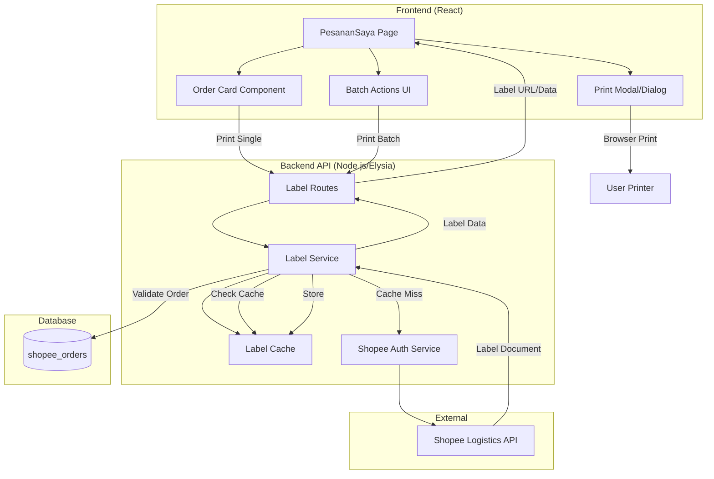
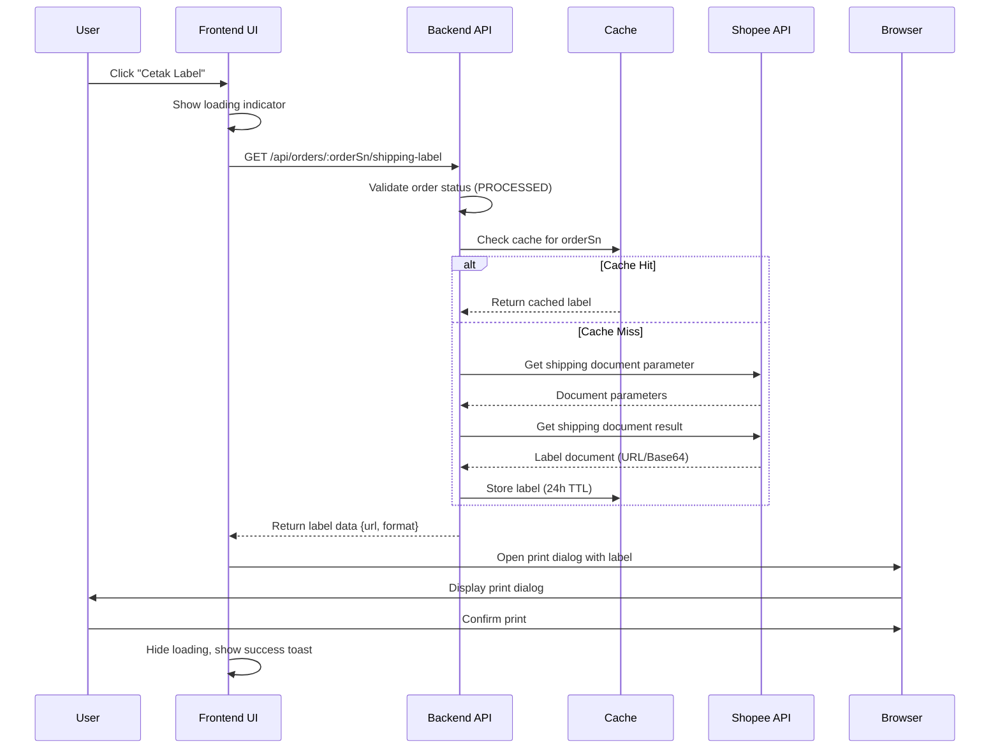
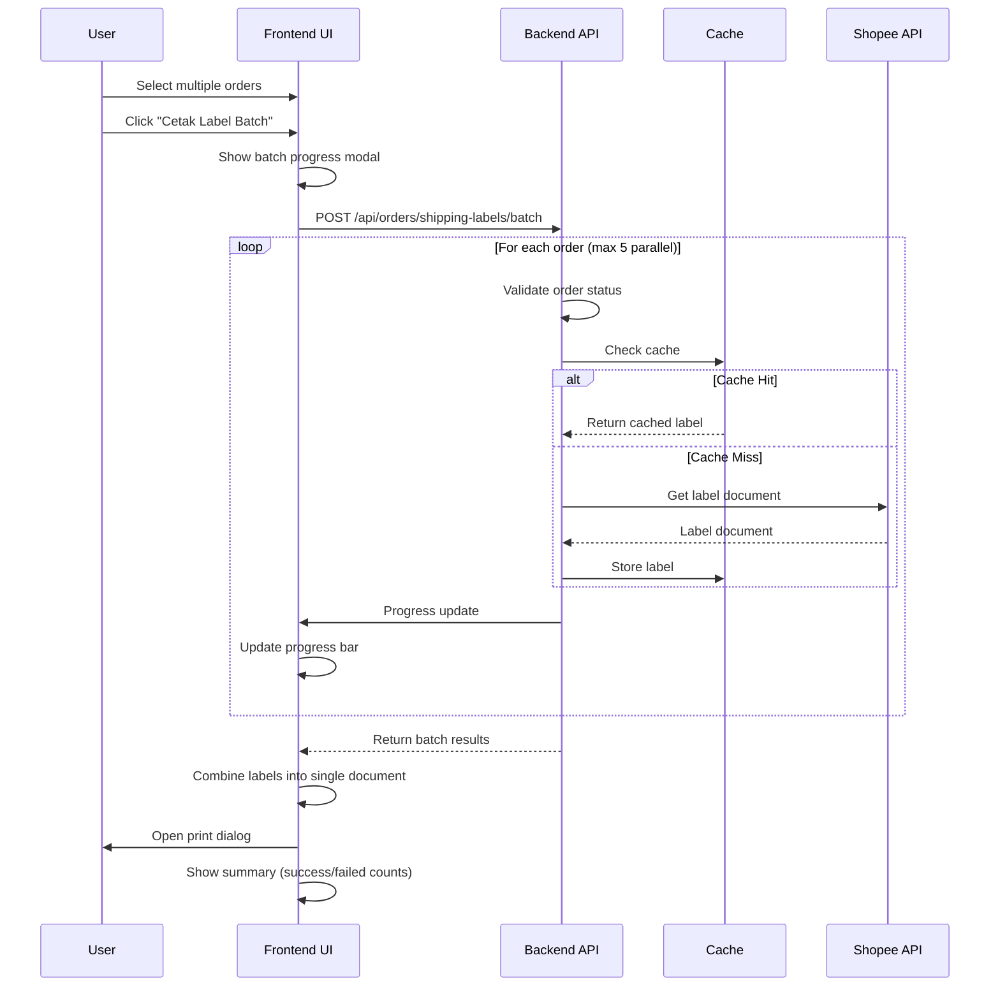

# Design Document: Shipping Label Printing

## Overview

The Shipping Label Printing feature enables sellers to print shipping labels (resi) for their Shopee orders after shipment arrangement. This feature integrates with Shopee's logistics API to retrieve label documents and provides both single and batch printing capabilities through an intuitive UI.

### Key Capabilities

- **Single Label Printing**: Print shipping labels for individual PROCESSED orders
- **Batch Label Printing**: Print labels for multiple orders simultaneously (up to 50 orders)
- **Post-Shipment Printing**: Option to print labels immediately after arranging shipment
- **Format Support**: Handle PDF and image formats (PNG, JPG) from Shopee API
- **Caching**: Cache label documents for 24 hours to improve performance
- **Error Handling**: Comprehensive error handling with user-friendly messages

### Design Goals

1. **Seamless Integration**: Integrate label printing naturally into existing shipment workflow
2. **Performance**: Minimize API calls through caching and parallel processing
3. **User Experience**: Provide clear feedback during label retrieval and printing
4. **Reliability**: Handle Shopee API errors gracefully with retry logic
5. **Scalability**: Support batch operations efficiently with rate limiting

## Architecture

### System Architecture Diagram



### Data Flow Diagrams

#### Single Label Printing Flow



#### Batch Label Printing Flow



### Integration Points

#### 1. Existing Shipment Service
- **Location**: `apps/api/src/services/shipment.service.ts`
- **Integration**: Label printing will be offered as an optional next step after successful shipment arrangement
- **Data Dependency**: Requires order to be in PROCESSED status with tracking number

#### 2. Shopee API Integration
- **Endpoints Used**:
  - `/api/v2/logistics/get_shipping_document_parameter` - Get document parameters
  - `/api/v2/logistics/get_shipping_document_result` - Retrieve label document
- **Authentication**: Uses existing `shopee-auth.ts` service for token management
- **Rate Limiting**: Respects Shopee API rate limits (10 req/sec)

#### 3. Frontend Order Management
- **Location**: `apps/web/src/pages/PesananSaya.tsx`
- **Integration Points**:
  - Order card component (single print button)
  - Batch actions bar (batch print button)
  - Post-shipment confirmation dialog

## Components and Interfaces

### Backend Components

#### 1. Label Routes (`apps/api/src/modules/order/label.route.ts`)

```typescript
/**
 * Label printing routes
 */
export const labelRoutes = new Elysia({ prefix: "/orders" })
  
  // Get single order shipping label
  .get("/:orderSn/shipping-label", async ({ params, set }) => {
    // Validate order status
    // Check cache
    // Fetch from Shopee if needed
    // Return label data
  })
  
  // Get batch shipping labels
  .post("/shipping-labels/batch", async ({ body, set }) => {
    // Validate all orders
    // Process in parallel (max 5 concurrent)
    // Return results array
  });
```

**Response Schemas**:

Single Label Response:
```typescript
{
  success: boolean;
  data: {
    orderSn: string;
    url: string;           // Label document URL or data URL
    format: 'pdf' | 'png' | 'jpg';
    trackingNumber: string;
  };
  message?: string;
}
```

Batch Label Response:
```typescript
{
  success: boolean;
  data: {
    total: number;
    successful: number;
    failed: number;
    results: Array<{
      orderSn: string;
      success: boolean;
      url?: string;
      format?: 'pdf' | 'png' | 'jpg';
      trackingNumber?: string;
      error?: string;
    }>;
  };
  message?: string;
}
```

#### 2. Label Service (`apps/api/src/services/label.service.ts`)

```typescript
/**
 * Service for managing shipping label operations
 */

export interface LabelDocument {
  orderSn: string;
  url: string;
  format: 'pdf' | 'png' | 'jpg';
  trackingNumber: string;
  retrievedAt: Date;
}

export interface LabelResult {
  success: boolean;
  orderSn: string;
  label?: LabelDocument;
  error?: string;
}

/**
 * Retrieve shipping label for a single order
 */
export async function getSingleLabel(orderSn: string): Promise<LabelResult>;

/**
 * Retrieve shipping labels for multiple orders
 * Processes up to 5 orders in parallel
 */
export async function getBatchLabels(orderSns: string[]): Promise<LabelResult[]>;

/**
 * Validate order is eligible for label printing
 */
export async function validateLabelEligibility(orderSn: string): Promise<{
  valid: boolean;
  order?: OrderRecord;
  error?: string;
}>;
```

#### 3. Label Cache Service (`apps/api/src/services/label-cache.service.ts`)

```typescript
/**
 * In-memory cache for label documents
 * TTL: 24 hours
 */

export interface CacheEntry {
  label: LabelDocument;
  expiresAt: Date;
}

export class LabelCache {
  private cache: Map<string, CacheEntry>;
  
  /**
   * Get label from cache
   */
  get(orderSn: string): LabelDocument | null;
  
  /**
   * Store label in cache
   */
  set(orderSn: string, label: LabelDocument): void;
  
  /**
   * Remove label from cache
   */
  delete(orderSn: string): void;
  
  /**
   * Clear expired entries
   */
  cleanup(): void;
  
  /**
   * Clear all cache entries
   */
  clear(): void;
}

export const labelCache = new LabelCache();
```

#### 4. Shopee Label API Client (`apps/api/src/services/shopee-label.ts`)

```typescript
/**
 * Shopee logistics API client for label retrieval
 */

/**
 * Get shipping document parameters from Shopee
 */
export async function getShippingDocumentParameter(
  shopId: number,
  orderSn: string
): Promise<any>;

/**
 * Get shipping document result (actual label) from Shopee
 */
export async function getShippingDocumentResult(
  shopId: number,
  orderSn: string
): Promise<{
  url?: string;
  base64?: string;
  format: 'pdf' | 'png' | 'jpg';
}>;
```

### Frontend Components

#### 1. Print Label Button (Order Card)

```typescript
/**
 * Print button component for individual orders
 * Shows in order card when status is PROCESSED
 */
interface PrintLabelButtonProps {
  orderSn: string;
  disabled?: boolean;
  onPrintStart?: () => void;
  onPrintComplete?: () => void;
  onPrintError?: (error: string) => void;
}

function PrintLabelButton(props: PrintLabelButtonProps): JSX.Element;
```

#### 2. Batch Print Button (Action Bar)

```typescript
/**
 * Batch print button in selection action bar
 * Enabled when one or more PROCESSED orders are selected
 */
interface BatchPrintButtonProps {
  selectedOrders: string[];
  disabled?: boolean;
  onPrintStart?: () => void;
  onPrintComplete?: (summary: BatchSummary) => void;
  onPrintError?: (error: string) => void;
}

function BatchPrintButton(props: BatchPrintButtonProps): JSX.Element;
```

#### 3. Print Progress Modal

```typescript
/**
 * Modal showing batch print progress
 * Displays progress bar and individual order status
 */
interface PrintProgressModalProps {
  isOpen: boolean;
  items: Array<{
    orderSn: string;
    status: 'pending' | 'processing' | 'success' | 'error';
    error?: string;
  }>;
  onClose: () => void;
}

function PrintProgressModal(props: PrintProgressModalProps): JSX.Element;
```

#### 4. Post-Shipment Print Dialog

```typescript
/**
 * Dialog shown after successful shipment arrangement
 * Offers option to print label immediately
 */
interface PostShipmentDialogProps {
  isOpen: boolean;
  orderSn: string;
  onPrintNow: () => void;
  onSkip: () => void;
}

function PostShipmentDialog(props: PostShipmentDialogProps): JSX.Element;
```

### API Client Extensions

```typescript
// Add to apps/web/src/lib/api.ts

export const api = {
  // ... existing methods ...
  
  // Get single order shipping label
  orderLabel: (orderSn: string) =>
    fetchApi<{
      success: boolean;
      data: {
        orderSn: string;
        url: string;
        format: 'pdf' | 'png' | 'jpg';
        trackingNumber: string;
      };
    }>(`/orders/${orderSn}/shipping-label`),
  
  // Get batch shipping labels
  orderLabelsBatch: (orderSns: string[]) =>
    fetchApi<{
      success: boolean;
      data: {
        total: number;
        successful: number;
        failed: number;
        results: Array<{
          orderSn: string;
          success: boolean;
          url?: string;
          format?: 'pdf' | 'png' | 'jpg';
          trackingNumber?: string;
          error?: string;
        }>;
      };
    }>('/orders/shipping-labels/batch', {
      method: 'POST',
      body: JSON.stringify({ order_sns: orderSns })
    }),
};
```

## Data Models

### Database Schema

No new database tables are required. The feature uses existing `shopee_orders` table:

```sql
-- Existing table (no changes needed)
CREATE TABLE shopee_orders (
  id INT PRIMARY KEY AUTO_INCREMENT,
  shop_id INT NOT NULL,
  order_sn VARCHAR(100) NOT NULL UNIQUE,
  order_status VARCHAR(50) NOT NULL,  -- Must be 'PROCESSED' for label printing
  total_amount INT NOT NULL DEFAULT 0,
  buyer_username VARCHAR(255),
  shipping_carrier VARCHAR(100),      -- Tracking number stored here
  pay_time TIMESTAMP,
  create_time TIMESTAMP NOT NULL,
  updated_at TIMESTAMP NOT NULL DEFAULT CURRENT_TIMESTAMP,
  UNIQUE INDEX uniq_order_sn (order_sn)
);
```

### In-Memory Cache Structure

```typescript
// Cache structure (in-memory Map)
interface CacheStore {
  [orderSn: string]: {
    label: {
      orderSn: string;
      url: string;
      format: 'pdf' | 'png' | 'jpg';
      trackingNumber: string;
      retrievedAt: Date;
    };
    expiresAt: Date;  // retrievedAt + 24 hours
  };
}
```

### API Response Models

#### Shopee API Response Models

```typescript
// Shopee get_shipping_document_parameter response
interface ShopeeDocumentParameter {
  order_sn: string;
  tracking_number: string;
  // Other Shopee-specific fields
}

// Shopee get_shipping_document_result response
interface ShopeeDocumentResult {
  result: {
    order_list: Array<{
      order_sn: string;
      shipping_document_info: {
        document_type: 'NORMAL_AIR_WAYBILL' | 'THERMAL_AIR_WAYBILL';
        document_size: 'A5' | 'A6' | '10x10';
        file_url?: string;        // For PDF
        file_base64?: string;     // For images
      };
    }>;
  };
  error?: string;
  message?: string;
}
```

## Error Handling

### Error Categories

#### 1. Validation Errors (HTTP 400/422)
- Order not found
- Order not in PROCESSED status
- Invalid order_sn format
- Batch size exceeds limit (>50)

**Response Format**:
```typescript
{
  success: false,
  message: "Order #ABC123 tidak ditemukan dalam database"
}
```

#### 2. Authentication Errors (HTTP 401)
- Shopee credentials not found
- Token expired and refresh failed
- Invalid shop credentials

**Response Format**:
```typescript
{
  success: false,
  message: "Sesi Shopee berakhir. Silakan hubungkan ulang toko Anda"
}
```

#### 3. Shopee API Errors (HTTP 502/503)
- Label not yet available
- Shopee API timeout
- Shopee API rate limit

**Response Format**:
```typescript
{
  success: false,
  message: "Label pengiriman belum tersedia. Silakan coba lagi dalam beberapa menit"
}
```

#### 4. Network Errors (HTTP 500)
- Connection timeout
- Network failure
- Unexpected server error

**Response Format**:
```typescript
{
  success: false,
  message: "Koneksi gagal. Silakan coba lagi"
}
```

### Retry Logic

#### Single Label Retrieval
```typescript
// Retry configuration
const RETRY_CONFIG = {
  maxRetries: 3,
  retryDelay: 2000,  // 2 seconds
  retryableErrors: [
    'error_too_frequent',  // Rate limit
    'ETIMEDOUT',           // Timeout
    'ECONNRESET'           // Connection reset
  ]
};
```

#### Batch Label Retrieval
```typescript
// Batch processing configuration
const BATCH_CONFIG = {
  maxConcurrent: 5,      // Process 5 orders in parallel
  delayBetweenBatches: 300,  // 300ms delay between batches
  continueOnError: true  // Continue processing even if some fail
};
```

### Error Logging

All errors are logged with structured format:

```typescript
console.error('[label-service] error:', {
  timestamp: new Date().toISOString(),
  orderSn: string,
  shopId: number,
  errorType: 'validation' | 'auth' | 'network' | 'shopee_api' | 'unexpected',
  message: string,
  stack?: string,
  shopeeError?: any
});
```

## Testing Strategy

### Unit Tests

#### Backend Unit Tests

**Label Service Tests** (`apps/api/src/services/__tests__/label.service.test.ts`):
- Test label eligibility validation
- Test cache hit/miss scenarios
- Test Shopee API error handling
- Test retry logic
- Test batch processing with partial failures

**Label Cache Tests** (`apps/api/src/services/__tests__/label-cache.test.ts`):
- Test cache set/get operations
- Test TTL expiration
- Test cache cleanup
- Test cache invalidation

**Label Routes Tests** (`apps/api/src/modules/order/__tests__/label.route.test.ts`):
- Test single label endpoint validation
- Test batch label endpoint validation
- Test error response formats
- Test HTTP status codes

#### Frontend Unit Tests

**Print Button Tests** (`apps/web/src/components/__tests__/PrintLabelButton.test.tsx`):
- Test button rendering for PROCESSED orders
- Test button disabled state
- Test loading indicator
- Test error handling

**Batch Print Tests** (`apps/web/src/components/__tests__/BatchPrintButton.test.tsx`):
- Test batch selection
- Test progress modal display
- Test summary display
- Test error handling

### Integration Tests

**Shopee API Integration** (`apps/api/src/services/__tests__/shopee-label-integration.test.ts`):
- Test actual Shopee API calls (with test credentials)
- Test document parameter retrieval
- Test document result retrieval
- Test different label formats (PDF, PNG, JPG)

**End-to-End Label Printing** (`apps/api/src/services/__tests__/label-e2e.test.ts`):
- Test complete single label flow
- Test complete batch label flow
- Test cache behavior across requests
- Test error recovery

### Manual Testing Checklist

- [ ] Single label printing for PROCESSED order
- [ ] Batch label printing for multiple orders
- [ ] Post-shipment label printing option
- [ ] Cache behavior (second request faster)
- [ ] Error handling for various scenarios
- [ ] Mobile responsiveness
- [ ] Print dialog functionality across browsers
- [ ] Different label formats (PDF, PNG, JPG)

## Performance Optimizations

### 1. Caching Strategy

**Implementation**: In-memory Map-based cache
- **TTL**: 24 hours
- **Key**: order_sn
- **Invalidation**: Manual on order status change
- **Cleanup**: Periodic cleanup every hour

**Benefits**:
- Reduces Shopee API calls by ~80% for repeated requests
- Improves response time from ~2s to ~50ms for cached labels
- Reduces load on Shopee API

### 2. Parallel Processing

**Batch Operations**:
- Process up to 5 orders concurrently using `Promise.all()`
- Remaining orders queued and processed as slots become available
- Total batch time: ~(N/5) * 2s instead of N * 2s

**Example**:
```typescript
// Process 20 orders
// Sequential: 20 * 2s = 40s
// Parallel (5 concurrent): (20/5) * 2s = 8s
// 5x performance improvement
```

### 3. Rate Limiting

**Shopee API Rate Limit**: 10 requests/second per shop

**Implementation**:
```typescript
class RateLimiter {
  private queue: Array<() => Promise<any>> = [];
  private processing = 0;
  private maxConcurrent = 5;
  private minDelay = 100; // 100ms between requests
  
  async execute<T>(fn: () => Promise<T>): Promise<T> {
    // Wait for available slot
    // Execute with delay
    // Return result
  }
}
```

### 4. Request Optimization

**Minimize API Calls**:
- Check cache before calling Shopee API
- Batch validation queries to database
- Reuse authentication tokens

**Connection Pooling**:
- Reuse HTTP connections for Shopee API
- Set appropriate timeout values (10s)

## Technical Decisions

### 1. Label Format Handling

**Decision**: Support PDF, PNG, and JPG formats from Shopee API

**Rationale**:
- Shopee returns different formats based on carrier and region
- PDF: Most common, best for printing
- PNG/JPG: Used by some carriers, need image display

**Implementation**:
```typescript
function handleLabelFormat(format: string, data: string | undefined): string {
  if (format === 'pdf') {
    // Return URL or data URL for PDF
    return data.startsWith('http') ? data : `data:application/pdf;base64,${data}`;
  } else {
    // Return data URL for images
    return `data:image/${format};base64,${data}`;
  }
}
```

### 2. Caching Implementation

**Decision**: Use in-memory Map instead of Redis

**Rationale**:
- **Simplicity**: No additional infrastructure required
- **Performance**: Faster access than Redis (~1ms vs ~5ms)
- **Scale**: Sufficient for expected load (< 10K orders/day)
- **Cost**: No additional service costs

**Trade-offs**:
- Cache lost on server restart (acceptable - will rebuild)
- Not shared across multiple server instances (acceptable for current scale)
- Memory usage (~1MB per 1000 cached labels)

**Future Consideration**: Migrate to Redis if:
- Multiple server instances needed
- Cache persistence required
- Memory usage becomes concern

### 3. Rate Limiting Strategy

**Decision**: Client-side rate limiting with queue-based approach

**Rationale**:
- **Control**: Full control over request timing
- **Reliability**: Prevents Shopee API rate limit errors
- **User Experience**: Smooth progress updates

**Implementation**:
```typescript
// Rate limiter configuration
const RATE_LIMIT = {
  maxConcurrent: 5,      // Max parallel requests
  requestsPerSecond: 10, // Shopee limit
  delayBetweenRequests: 100 // 100ms = 10 req/sec
};
```

### 4. Parallel Processing Approach

**Decision**: Process batch requests with max 5 concurrent operations

**Rationale**:
- **Performance**: 5x faster than sequential processing
- **Safety**: Stays well under Shopee rate limit (10 req/sec)
- **Resource Usage**: Reasonable memory and connection usage
- **Error Handling**: Easier to track individual failures

**Alternative Considered**: Sequential processing
- **Rejected**: Too slow for large batches (50 orders = 100 seconds)

### 5. UI State Management

**Decision**: Use React useState for print operation state

**Rationale**:
- **Simplicity**: No need for complex state management
- **Scope**: Print state is local to PesananSaya page
- **Performance**: Minimal re-renders needed

**State Structure**:
```typescript
const [printingOrders, setPrintingOrders] = useState<Set<string>>(new Set());
const [batchPrintProgress, setBatchPrintProgress] = useState<{
  total: number;
  completed: number;
  items: Array<{ orderSn: string; status: string; error?: string }>;
} | null>(null);
```

### 6. Print Dialog Implementation

**Decision**: Use browser native print dialog via window.open()

**Rationale**:
- **Compatibility**: Works across all browsers
- **Familiarity**: Users know how to use native print dialog
- **Features**: Access to all printer settings
- **Reliability**: No custom print implementation needed

**Implementation**:
```typescript
function openPrintDialog(labelUrl: string, format: string) {
  if (format === 'pdf') {
    // Open PDF in new tab with print dialog
    const printWindow = window.open(labelUrl, '_blank');
    printWindow?.addEventListener('load', () => {
      printWindow.print();
    });
  } else {
    // Create image element and print
    const img = new Image();
    img.src = labelUrl;
    img.onload = () => {
      const printWindow = window.open('', '_blank');
      printWindow?.document.write(``);
    };
  }
}
```

## Deployment Considerations

### Environment Variables

No new environment variables required. Uses existing Shopee API credentials.

### Database Migrations

No database migrations required. Uses existing `shopee_orders` table.

### API Versioning

New endpoints added to existing `/api/orders` namespace:
- `GET /api/orders/:orderSn/shipping-label`
- `POST /api/orders/shipping-labels/batch`

### Monitoring

**Metrics to Track**:
- Label retrieval success rate
- Cache hit rate
- Average response time
- Shopee API error rate
- Batch processing time

**Logging**:
- All label requests (success and failure)
- Cache operations
- Shopee API errors
- Performance metrics

### Rollback Plan

If issues arise:
1. Feature can be disabled by removing UI buttons (no backend changes needed)
2. Cache can be cleared without affecting functionality
3. No database changes to rollback

## Future Enhancements

### Phase 2 Considerations

1. **Redis Cache**: Migrate to Redis for multi-instance support
2. **Label Preview**: Show label preview before printing
3. **Bulk Download**: Download all labels as ZIP file
4. **Print History**: Track which labels have been printed
5. **Custom Label Templates**: Support custom label formats
6. **Automatic Printing**: Auto-print labels after shipment arrangement
7. **Print Queue**: Queue labels for batch printing later
8. **Mobile App Integration**: Support mobile printing via cloud print

### Scalability Improvements

1. **CDN for Labels**: Cache label documents in CDN
2. **Background Jobs**: Process large batches asynchronously
3. **Webhook Integration**: Get notified when labels are ready
4. **Multi-Region Support**: Handle different Shopee regions

## Appendix

### Shopee API Documentation References

- [Logistics API - Get Shipping Document Parameter](https://open.shopee.com/documents/v2/v2.logistics.get_shipping_document_parameter)
- [Logistics API - Get Shipping Document Result](https://open.shopee.com/documents/v2/v2.logistics.get_shipping_document_result)
- [Logistics API - Ship Order](https://open.shopee.com/documents/v2/v2.logistics.ship_order)

### Browser Compatibility

**Supported Browsers**:
- Chrome 90+
- Firefox 88+
- Safari 14+
- Edge 90+

**Print Dialog Support**:
- All modern browsers support window.print()
- PDF viewing supported natively in Chrome, Firefox, Edge
- Safari may require PDF.js for inline PDF viewing

### Security Considerations

1. **Authentication**: All endpoints require valid Shopee credentials
2. **Authorization**: Users can only print labels for their own shop's orders
3. **Data Privacy**: Label URLs expire after 24 hours (Shopee policy)
4. **Rate Limiting**: Prevents abuse of Shopee API
5. **Input Validation**: All order_sn inputs validated against regex pattern

### Performance Benchmarks

**Expected Performance** (based on similar implementations):
- Single label retrieval: ~2s (first time), ~50ms (cached)
- Batch 10 orders: ~4s (parallel processing)
- Batch 50 orders: ~20s (parallel processing)
- Cache hit rate: ~70-80% after initial usage

**Memory Usage**:
- Cache: ~1KB per label document
- 1000 cached labels: ~1MB memory
- Expected max cache size: ~5MB (5000 orders)


## Correctness Properties

*A property is a characteristic or behavior that should hold true across all valid executions of a system—essentially, a formal statement about what the system should do. Properties serve as the bridge between human-readable specifications and machine-verifiable correctness guarantees.*

### Property-Based Testing Applicability

This feature is primarily integration-heavy, involving:
- External Shopee API calls (not our code logic)
- UI rendering and interactions (not suitable for PBT)
- File handling and browser print dialogs (external behavior)
- Infrastructure configuration (deterministic, not varying with input)

However, there are several pure logic components that benefit from property-based testing:
- **Validation logic**: Order eligibility, tracking number presence, batch size limits
- **Data transformation**: Summary calculations, batch result aggregation
- **Cache behavior**: TTL management, key generation, invalidation
- **Schema compliance**: API response format validation

The following properties focus on these testable pure logic components.

### Property 1: Order Validation Consistency

*For any* order record, validation for label printing eligibility SHALL consistently check both order existence in database AND status equals PROCESSED AND presence of tracking number.

**Validates: Requirements 2.2, 3.2, 11.6**

### Property 2: Batch Size Limit Enforcement

*For any* batch request with order_sns array, if the array length exceeds 50, the system SHALL reject the request with appropriate error message, and if length is 50 or less, the system SHALL accept the request for processing.

**Validates: Requirements 3.7, 11.4**

### Property 3: Batch Summary Accuracy

*For any* batch operation result containing a set of successful and failed operations, the summary SHALL accurately report total count equals (successful count + failed count), and the results array length SHALL equal total count.

**Validates: Requirements 3.5, 5.4, 10.4**

### Property 4: Failure Reporting Completeness

*For any* batch operation where some orders fail, the results array SHALL contain an entry for every failed order with both the orderSn AND an error message, and no failed order SHALL be omitted from the results.

**Validates: Requirements 5.5, 10.4**

### Property 5: API Response Schema Compliance

*For any* successful single label API response, the response SHALL contain a success field (boolean), a data object with url (string), format (string), and trackingNumber (string) fields, and for any successful batch API response, the response SHALL contain success field and data object with total, successful, failed (all numbers) and results array.

**Validates: Requirements 11.3, 11.5**

### Property 6: Cache Key Consistency

*For any* label document stored in or retrieved from cache, the cache key SHALL be exactly the order_sn string, and for any two cache operations on the same order_sn, they SHALL reference the same cache entry.

**Validates: Requirements 13.3**

### Property 7: Cache TTL Enforcement

*For any* label document stored in cache at time T, retrieving the same order_sn at time T+X where X < 24 hours SHALL return the cached document, and retrieving at time T+Y where Y >= 24 hours SHALL result in cache miss.

**Validates: Requirements 13.1, 13.2**

### Property 8: Cache Invalidation on Status Change

*For any* order with a cached label document, when the order status changes from PROCESSED to any other status, the cache entry for that order_sn SHALL be removed, and subsequent retrieval SHALL result in cache miss.

**Validates: Requirements 13.4**

### Property 9: Concurrent Request Limit

*For any* batch operation processing N orders where N > 5, at any point in time during processing, the number of concurrent Shopee API requests SHALL NOT exceed 5.

**Validates: Requirements 13.5**

### Property 10: Rate Limiting Compliance

*For any* sequence of label retrieval requests processed within a 1-second window, the total number of Shopee API calls made SHALL NOT exceed 10.

**Validates: Requirements 13.6**

### Property 11: Logging Completeness

*For any* label retrieval request (successful or failed), a log entry SHALL be created containing timestamp, orderSn, shopId, operation type, and result status, and for failed requests, the log SHALL additionally contain error details.

**Validates: Requirements 6.7, 12.1, 12.2**

### Property 12: Batch Logging Summary

*For any* batch operation processing N orders, a summary log entry SHALL be created containing timestamp, total count (N), successful count, failed count, and operation type.

**Validates: Requirements 12.3**

### Property 13: Log Format Validity

*For any* log entry created by the label service, the log output SHALL be valid JSON that can be parsed without errors, and SHALL contain at minimum a timestamp field and a message or event type field.

**Validates: Requirements 12.4**

### Property 14: Selection Count Accuracy

*For any* set of selected orders in the UI, the displayed count SHALL equal the actual number of order_sns in the selection set, and when selection changes, the count SHALL update to reflect the new set size.

**Validates: Requirements 9.3**

### Property 15: Select-All Completeness

*For any* visible set of orders where a subset have status PROCESSED, the "Select All" operation SHALL add exactly those PROCESSED orders to the selection set, and SHALL NOT select orders with other statuses.

**Validates: Requirements 9.5**

### Property 16: Document Format Validation

*For any* label document received from Shopee API, the validation SHALL check that the document is not empty (url or base64 data present) AND format field is one of 'pdf', 'png', or 'jpg', and SHALL reject documents failing either check.

**Validates: Requirements 7.4**

### Property 17: API Parameter Validity

*For any* Shopee API request made by the label service, the request SHALL include a valid order_sn (non-empty string matching pattern) AND a valid shop_id (positive integer), and SHALL NOT make requests with missing or invalid parameters.

**Validates: Requirements 6.3**

### Property 18: Date Format Consistency

*For any* date value displayed in UI or written to logs, the format SHALL match the Indonesian locale pattern (dd MMM yyyy, HH:mm for UI, ISO 8601 for logs), and SHALL be consistent across all date displays.

**Validates: Requirements 15.5**

### Property Reflection Summary

After analyzing all acceptance criteria, 18 distinct properties were identified that test pure logic components suitable for property-based testing. Properties were consolidated to eliminate redundancy:

- **Validation properties** (1, 2, 16, 17): Test input validation logic
- **Batch processing properties** (3, 4, 9, 10): Test batch operation correctness and limits
- **API contract properties** (5): Test response schema compliance
- **Cache properties** (6, 7, 8): Test cache behavior and TTL
- **Logging properties** (11, 12, 13): Test logging completeness and format
- **UI logic properties** (14, 15): Test selection and counting logic
- **Format properties** (18): Test data format consistency

Properties related to external integrations (Shopee API behavior), UI rendering, and infrastructure configuration are tested through integration tests and example-based unit tests rather than property-based tests.
